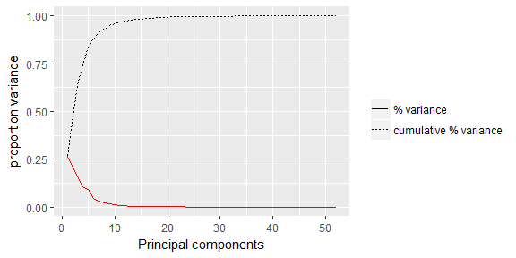
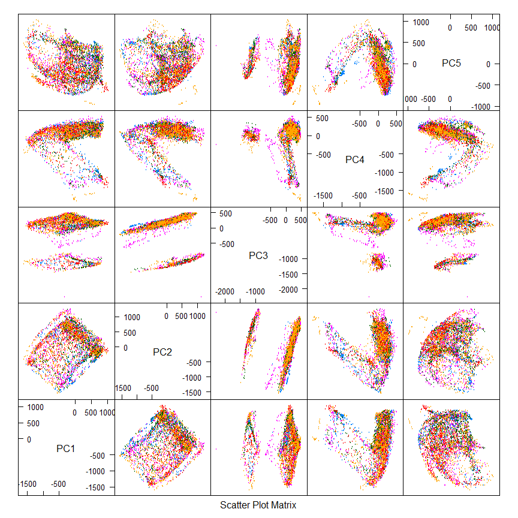

# How Well Do You Exercise?
Bruno Fischer Colonimos  
`r format(Sys.Date(), '%d %B %Y')`  

*********************************

<!-- We begin now with the R code. see below for the Report text (next HTML comment) -->

<!-- Comment: Here begins the report display part -->

Report Summary {-}
===============
This report describes the construction of a predictive model for the quality of execution of a training exercises - a classification model based on sensor data. After first selecting usable features and a short exploration, several models are trained and compared. After that, the best three models are combined in order to yield a better prediction, which out-of-sample accuracy is nearly perfect. 

*********************************

The Problem, and the Data  {#sec:problem}
=========================

The context  {#sec:context}
-----------
The aim of original study was to determine, based on sensor measures, if an exercise has been correctly performed. This is coded as A (correct) or B , C, D or E (different types of mistakes). We are required to predict the value of this "Classe", for a test set of sensor measures.

Understanding the data  {#sec:understand}
----------------------
We have to define the work at hand and specify the possible features to use, accordig to the context of the study, the available dataset, and the required results: predicting the variable "classe" for 20 observations in the test set. 

### The training dataset
There are two types of observations, and six types of features

* Two types of observational units:
    * Each row of the data frame for which `new_window == no` represents a set of "raw" sensor measures made at the same point in time, and the "Classe", which qualifies the exercise repetition this observation belongs to.
    * Each row such that `new_window == yes` represents a) a set of the same measurements, but also b) a set of summaries (average, std dev, min...etc) of these measurement, computed on a series of consecutive observations (a "window").
* six types of features, namely:
    * observation ID ('x')
    * subject ('user_name')
    * chronological information (raw_timestamp_part_1, raw_timestamp_part_2, cvtd_timestamp, new_window, num_window)
    * raw sensor values (roll_belt, pitch_belt, ..., magnet_forearm_z)
    * aggregate summaries of these values, computed on a window, and only defined if `new_window == yes`: (min_roll_belt , kurtosis_picth_arm, ..., var_yaw_dumbbell...)
    * the 'Classe' of the exercise repetition the observation belongs to. 

Remark: in [several posts of the forum](https://www.coursera.org/learn/practical-machine-learning/discussions/weeks/4/threads/awQPK214EeaseQ52nc1ePQ), students have pointed out that the summary information is not consistent with the available raw values. This might be because we only have here a subset of the original dataset (39242 observations).

### The test dataset: What information is available at the time of prediction?

The test dataset is similar, but:

* Of course _"classe"_ is missing, ( we wish to predict its value ).
* We have only 20 observations
* None of these is such that `new_window == yes`, and the corresponding summaries __cannot be reconstructed__, as we do not have the other observations of the same "window".
* we do not know other time-related  observations (of the same or from a previous window, for example)

Consequences : usable features  {#sec:features}
------------------------------
Consequently, chronological and summary information is not usable (because not available when predicting). We can potentially use only: **raw sensor values** variables and `user_name`, but using `user_name` would be dubious, as new observations may come from new subjects, which are not part of the training dataset (It is the case in the "test set" with the subject named "charles"). Also, using `x` (the observation Id number), would be nonsensical.
 

Data preparation {#sec:dataprep}
----------------
We eliminate from all datasets the variables that we can't use, and we keep all the rows. Then, 

* 53 features remain, all of them numeric. 
* We observe that we don't have any missing value any more.

Data splitting {#sec:datasplit}
--------------

We intend to use cross-validation in order to estimate out-of-sample accuracy and compare predictive models. Consequently we could do without a hold-out sample ([see discussion here](https://stats.stackexchange.com/questions/104713/hold-out-validation-vs-cross-validation)). However, we will have to combine (stack) predictors together in order to obtain the best accuracy. Due to the dual-step nature of this process, it is not very clear to us how we could do this while making sure that, each time, the predictions evaluated are be those made for observation which were __not used__ for training the model. (i.e. to estimate accuracy, __both__ a) prediction from primary models, b) training of a new model based on these predictions, and c) finally predictions of the new model, should be done on new observations). The  training/testing setup used is then the following:

We have been supplied with :

* a _test set_ of 20 observation. It will only be used in the final stage (i.e. the "quiz" part) of the project
* a _training set_ of 19622 obsercations. This set will be randomly split (using `caret`) in:
    * a _"true" training set_ (75% of the supplied original _"training set"_)
    * a _"validation set"_ (25%), which will be used to
        * get a reference point to compare the cross-validation accuracy estimations to,
        * evaluate the accuracy of the "combined" predictive models. 
     

Exploration {#sec:exploration}
===========

In the (true) training set, the distribution of the classes to predict is the following:

Table: 'Classe' distribution in the (true) training set

                       A         B         C         D         E
--------------  --------  --------  --------  --------  --------
Frequency        4185.00   2848.00   2567.00   2412.00   2706.00
Rel.frequency       0.28      0.19      0.17      0.16      0.18

To get some idea of the problem at hand, we have tried using Principal Components Analysis on the features, and graphically represent (a subset of) the training set, getting the following figures:

Variance explained by principal components 

'Classe' patterns in principal components

These figures suggest that:

* A large part of the overall variance is captured by the first few principal components
* There are definite class patterns differences that a predictive algorithm might pick up 
* The Bayes boundaries of this problem are highly non-linear, thus, efficient algorithms will likely be 
    a. non linear, and 
    b. quite flexible (i.e. small k-value in a KNN model)
* They also suggest that preprocessing the features with PCA is likely to be beneficial, to most algorithms, expecially those sensitive to high dimensionnality (knn). This will be confirmed later by our prediction attempts.

Model-building {#sec:modelbuild}
=================

Test error estimates - K-fold cross-validation {#sec:cross}
----------------------------------------------
In order to compare classification methodes and tune their parameters, we need to estimate the test error. For reasons explained [above](#sec:datasplit), we primarily use k-fold crossvalidation, but we also keep a validation subsample. \ 
The number of folds k will be __5__. (See James & al (2013), page 184 : _"Typically [...], one performs k-folds cross-validation using k = 5 or k = 10, as these values have been shown empirically to yield test error rates estimates that suffer neither from excessively high bias nor from very high variance"_ ). 

Models training and comparison {#sec:traincomp}
-------------------------------

We now try and compare a nuber of common classification models. The results are shown in the table.

Name                     Method   Preprocess   Best.tune        Accuracy.resampling   Accuracy.validation
-----------------------  -------  -----------  --------------  --------------------  --------------------
KNN                      knn      None         k = 5                          0.893                 0.925
KNN with PCA             knn      pca          k = 5                          0.947                 0.965
CART with PCA            rpart    pca          cp = 0.0365                    0.396                 0.377
Random Forest with PCA   rf       pca          mtry = 2                       0.970                 0.980
QDA                      qda      None         parameter = 1                  0.891                 0.897
QDA with PCA             qda      pca          parameter = 1                  0.729                 0.740
LDA with PCA             lda      pca          parameter = 1                  0.523                 0.525

These results show that the three independent and most efficient methods among our attempts are:

* K-Nearest-Neighbours (with PCA preprocessing)
* Random Forest (with PCA)
* Quadratic Discriminant Analysis (without preprocessing)

Models combination (via stacking) {#sec:combine}
-------------------------------

We now combine these models by stacking (Leeks (2015), lecture 4.3), i.e.:

1. We predict class probabilities (on the training and the validation sample) with each model and generate 15 new covariates
2. We train a model (on the training sample) using these new covariates
3. We predict the class (on the validation sample) using this model and estimate out-of-sample performance.

The results are: 

Name                Method   Preprocess   Best.tune    Accuracy.resampling   Accuracy.validation
------------------  -------  -----------  ----------  --------------------  --------------------
Knn (combination)   knn      None         k = 9                    0.99993                 0.985
rf (combination)    rf       None         mtry = 2                 1.00000                 0.983

Each of these two models have an estimated out-of-sample accuracy which is better than any of the previously tried models.

Predicting test-set classes {#sec:predict}
---------------------------

We then use the stacked knn model to finally generate predictions for the given test set (quizz part).

Entering these predictions in the quizz form results in a feedback stating a 95% accuracy (all predictions match save one).

Concluding remarks {#sec:conclude}
===================

Our two final prediction algorithms both have an estimated accuracy very close to 100%. While this is in agreement with the mentor advice, it is very unlikely to be found in any real-life application, (as some posts have pointed out), especially as the authors of the original study claim accuracies around 75%.  

*********************************

Bibliography, References {-}
========================

Posts:\
CrossValidated: _hold-out validation vs cross validation_: (https://stats.stackexchange.com/questions/104713/hold-out-validation-vs-cross-validation)

Forum: _kurtosis values don't match_ ; https://www.coursera.org/learn/practical-machine-learning/discussions/weeks/4/threads/awQPK214EeaseQ52nc1ePQ

Advice from the mentor:\
Greski L. (2015): _Improving Performance of Random Forest in caret::train()_ ; https://github.com/lgreski/datasciencectacontent/blob/master/markdown/pml-randomForestPerformance.md

Greski L. (2015): _Required Model Accuracy for Course project_ ; https://github.com/lgreski/datasciencectacontent/blob/master/markdown/pml-requiredModelAccuracy.md

Greski L. (2015): _pml-gh Pages Setup_ ; https://github.com/lgreski/datasciencectacontent/blob/master/markdown/pml-ghPagesSetup.md

Book:\
James G, Witten D., Hastie T., Tibshirani R. (2013): _Introduction to Statistical Learning_ ; Springer.

Course:\
Leeks J. (2015):     _Practical Machine Learning_; Johns Hopkins University / Coursera

Data derived from:\
Velloso, E.; Bulling, A.; Gellersen, H.; Ugulino, W.; Fuks, H. (2013):
 _Qualitative Activity Recognition of Weight Lifting Exercises_, 
Proceedings of 4th International Conference in Cooperation with SIGCHI (Augmented Human '13) . Stuttgart, Germany: ACM SIGCHI, 2013.
[See more](http://groupware.les.inf.puc-rio.br/har#weight_lifting_exercises#ixzz4nrBaHTUn)

